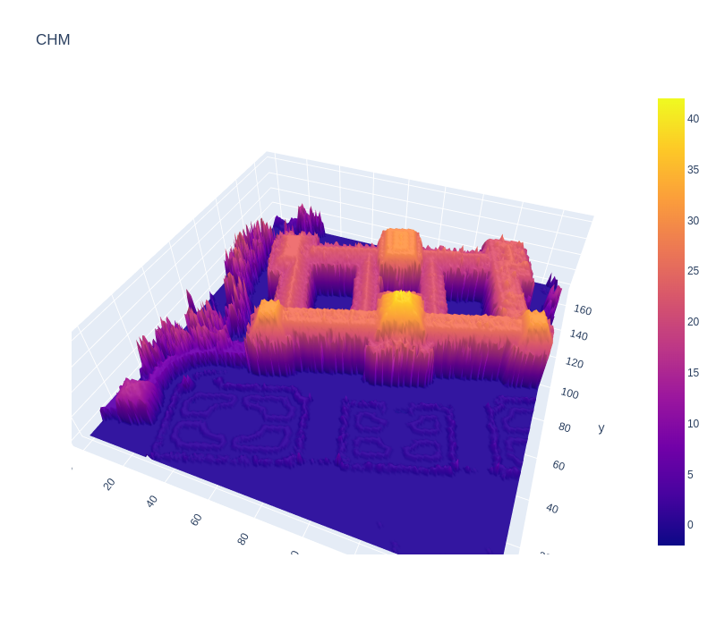
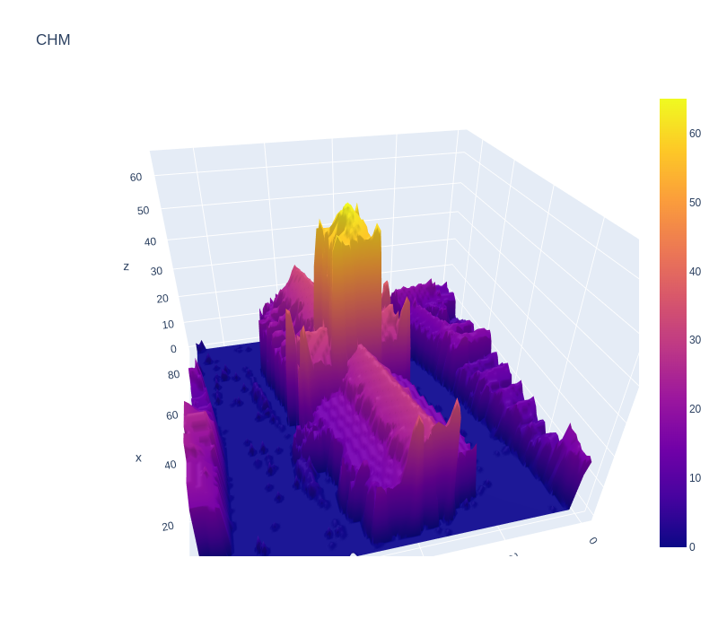

# 3D Houses in Belgium

  
   

### Description:
This is a project to visualize a house in 3D using Georefrenced data in Python.
The georefrenced data was available in the form of DSM (Digital Surface Map) and DTM (Digital Terrain Map) collected using LIDAR scanner.
For this project only the TIFF file was used but the all the shapefiles ware available.
House address was downloaded from 'https://opendata.bosa.be/download/best/openaddress-bevlg.zip' public API.
### Python version
**Python 3.8.12**

### Installation
- The Python version mentioned above
- Streamlit
- Anaconda environment (optional)
- Jupyter notebook (optional)
- Python libraries that are mentioned in the requirements.txt

### Instructions
1- Clone the code from the repository in the address https://github.com/BiniamBerhe/3D_House
2- Open your termial
3- Go to the folder you just cloned from Github
4- Type the command "streamlit run app.py"
5- Go to the browser and follow the instructions
6- The script is set to render the image on streamlit app.

### Further info
- for more info on the code look into the nootbooks provided in nootbooks folder

